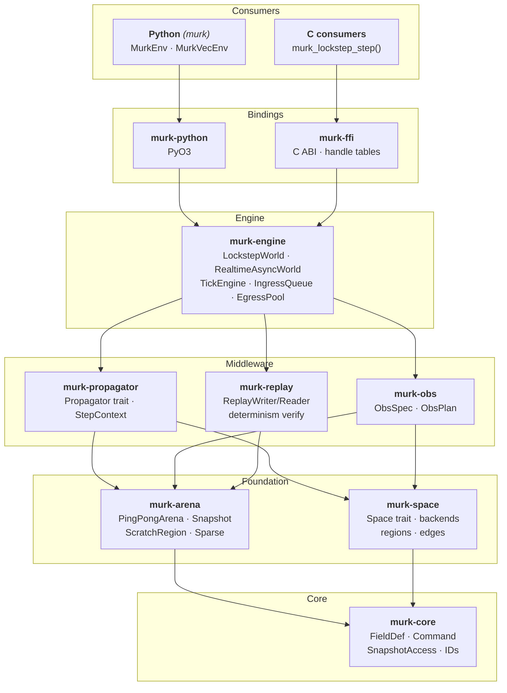

# Murk

[](https://crates.io/crates/murk)
[](https://pypi.org/project/murk/)
[](https://github.com/tachyon-beep/murk/actions/workflows/ci.yml)
[](https://tachyon-beep.github.io/murk/)
[](https://codecov.io/gh/tachyon-beep/murk)

A world simulation engine for reinforcement learning and real-time applications.

Murk provides a tick-based simulation core with pluggable spatial backends,
a modular propagator pipeline, ML-native observation extraction, and
Gymnasium-compatible Python bindings — all backed by arena-based
generational allocation for deterministic, zero-GC memory management.

## Features

- **Spatial backends** — Line1D, Ring1D, Square4, Square8, Hex2D, and
  composable ProductSpace (e.g. Hex2D × Line1D)
- **Propagator pipeline** — stateless per-tick operators with automatic
  write-conflict detection, Euler/Jacobi read modes, and CFL validation
- **Observation extraction** — ObsSpec → ObsPlan → flat `f32` tensors with
  validity masks, foveation, pooling, and multi-agent batching
- **Two runtime modes** — `LockstepWorld` (synchronous, borrow-checker
  enforced) and `RealtimeAsyncWorld` (background tick thread with epoch-based
  reclamation)
- **Deterministic replay** — binary replay format with per-tick snapshot
  hashing and divergence reports
- **Arena allocation** — double-buffered ping-pong arenas with Static/PerTick/Sparse
  field mutability classes; no GC pauses, no `Box<dyn>` per cell
- **C FFI** — stable ABI with handle tables (slot+generation), safe
  double-destroy, versioned
- **Python bindings** — PyO3/maturin native extension with Gymnasium `Env`
  and `VecEnv` adapters
- **Zero `unsafe` in simulation logic** — only `murk-arena` and `murk-ffi`
  are permitted `unsafe`; everything else is `#![forbid(unsafe_code)]`

## Architecture



## Prerequisites

**Rust** (for building from source or using the Rust API):
- Rust toolchain (stable, 1.87+): [rustup.rs](https://rustup.rs/)

**Python** (for the Gymnasium bindings):
- Python 3.12+
- numpy >= 1.24, gymnasium >= 0.29 (installed automatically)

## Quick start

### Installation

**Rust** (from [crates.io](https://crates.io/crates/murk)):

```bash
cargo add murk
```

**Python** (from [PyPI](https://pypi.org/project/murk/)):

```bash
pip install murk
```

### Rust

```bash
cargo run --example quickstart -p murk-engine
```

See [`crates/murk-engine/examples/quickstart.rs`](crates/murk-engine/examples/quickstart.rs)
for a complete working example: space creation, field definitions, a diffusion
propagator, command injection, snapshot reading, and world reset.

```rust
use murk_core::{FieldId, FieldReader, SnapshotAccess};
use murk_engine::{LockstepWorld, WorldConfig};

let mut world = LockstepWorld::new(config)?;
let result = world.step_sync(vec![])?;
let heat = result.snapshot.read(FieldId(0)).unwrap();
```

### Python

```python
import murk
from murk import Config, FieldMutability, EdgeBehavior, WriteMode, ObsEntry, RegionType

config = Config()
config.set_space_square4(16, 16, EdgeBehavior.Absorb)
config.add_field("heat", mutability=FieldMutability.PerTick)
# ... add propagators ...

env = murk.MurkEnv(config, obs_entries=[ObsEntry(0, region_type=RegionType.All)], n_actions=5)
obs, info = env.reset()

for _ in range(1000):
    action = policy(obs)
    obs, reward, terminated, truncated, info = env.step(action)
```

## Workspace crates

| Crate | Description |
|---|---|
| **`murk`** | **Top-level facade — add this one dependency for the full Rust API** |
| `murk-core` | Leaf crate: IDs, field definitions, commands, core traits |
| `murk-arena` | Arena-based generational allocation (ping-pong, sparse, static) |
| `murk-space` | Spatial backends and region planning |
| `murk-propagator` | Propagator trait, pipeline validation, step context |
| `murk-propagators` | Reference propagators: diffusion, agent movement, reward |
| `murk-obs` | Observation specification, compilation, and tensor extraction |
| `murk-engine` | Simulation engine: lockstep and realtime-async modes |
| `murk-replay` | Deterministic replay recording and verification |
| `murk-ffi` | C ABI bindings with handle tables |
| `murk-python` | Python/PyO3 bindings with Gymnasium adapters |
| `murk-bench` | Benchmark profiles and utilities |
| `murk-test-utils` | Shared test fixtures |

## Examples

| Example | Demonstrates |
|---------|-------------|
| [`heat_seeker`](examples/heat_seeker/) | PPO RL on Square4, Python propagator, diffusion |
| [`hex_pursuit`](examples/hex_pursuit/) | Hex2D, multi-agent, AgentDisk foveation |
| [`crystal_nav`](examples/crystal_nav/) | FCC12 3D lattice navigation |
| [`layered_hex`](examples/layered_hex/) | ProductSpace (Hex2D × Line1D), multi-floor navigation |
| [`quickstart.rs`](crates/murk-engine/examples/quickstart.rs) | Rust API: propagator, commands, snapshots |
| [`realtime_async.rs`](crates/murk-engine/examples/realtime_async.rs) | RealtimeAsyncWorld: background ticking, observe, shutdown |
| [`replay.rs`](crates/murk-engine/examples/replay.rs) | Deterministic replay: record, verify, prove determinism |

See [`docs/CONCEPTS.md`](docs/CONCEPTS.md) for a guide to Murk's mental model
(spaces, fields, propagators, commands, observations).

## Documentation

- **[API Reference (rustdoc)](https://tachyon-beep.github.io/murk/api/)** — auto-published on every push to `main`

## Design

Murk's architecture is documented in [`docs/ARCHITECTURE.md`](docs/ARCHITECTURE.md).

Key design decisions:

- **Arena-based generational allocation** over traditional CoW — enables
  zero-copy snapshots and deterministic memory lifetimes
- **Mode duality** — Lockstep is a callable struct (`&mut self`), RealtimeAsync
  is an autonomous thread; no runtime mode-switching
- **Propagator trait** — `&self` with split-borrow `StepContext`; reads/reads_previous/writes
  pattern supports both Euler and Jacobi integration styles
- **Egress Always Returns** — observation extraction never blocks, even during
  tick failures or shutdown

## Testing

660+ tests across the workspace, all passing:

```bash
cargo test --workspace           # Unit and integration tests
cargo +nightly miri test -p murk-arena   # Memory safety verification
```

CI runs check, test, clippy, rustfmt, and Miri on every push and PR.

## License

[MIT](LICENSE) — Copyright (c) 2026 John Morrissey
