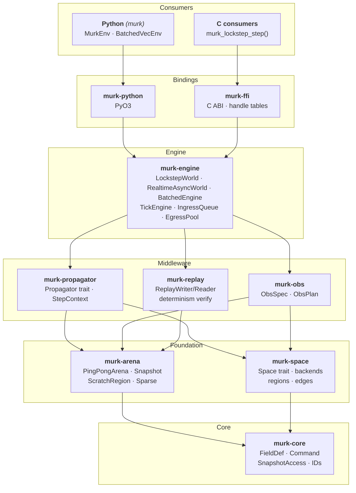

# Murk

[](https://crates.io/crates/murk)
[](https://pypi.org/project/murk/)
[](https://github.com/tachyon-beep/murk/actions/workflows/ci.yml)
[](https://tachyon-beep.github.io/murk/)
[](https://codecov.io/gh/tachyon-beep/murk)

A world simulation engine for reinforcement learning and real-time applications.

Murk provides a tick-based simulation core with pluggable spatial backends,
a modular propagator pipeline, ML-native observation extraction, and
Gymnasium-compatible Python bindings — all backed by arena-based
generational allocation for deterministic, zero-GC memory management.

## Table of Contents

- [Features](#features)
- [Architecture](#architecture)
- [Prerequisites](#prerequisites)
- [Quick Start](#quick-start)
- [Workspace Crates](#workspace-crates)
- [Examples](#examples)
- [Modeling Concepts](#modeling-concepts)
- [Documentation](#documentation)
- [Design](#design)
- [Testing](#testing)
- [Next Steps](#next-steps)
- [License](#license)

## Features

- **Spatial backends** — Line1D, Ring1D, Square4, Square8, Hex2D, and
  composable ProductSpace (e.g. Hex2D × Line1D)
- **Propagator pipeline** — stateless per-tick operators with automatic
  write-conflict detection, Euler/Jacobi read modes, and topology-aware
  CFL validation (`max_dt(space)`)
- **Observation extraction** — ObsSpec → ObsPlan → flat `f32` tensors with
  validity masks, foveation, pooling, and multi-agent batching
- **Two runtime modes** — `LockstepWorld` (synchronous, borrow-checker
  enforced) and `RealtimeAsyncWorld` (background tick thread with epoch-based
  reclamation)
- **Batched engine** — `BatchedEngine` steps N worlds and extracts
  observations in one call with a single GIL release; `BatchedVecEnv`
  provides an SB3-compatible Python interface
- **Deterministic replay** — binary replay format with per-tick snapshot
  hashing and divergence reports
- **Arena allocation** — double-buffered ping-pong arenas with Static/PerTick/Sparse
  field mutability classes; no GC pauses, no `Box<dyn>` per cell
- **Step metrics observability** — per-step timings plus sparse retirement
  and sparse reuse counters (`sparse_retired_ranges`, `sparse_pending_retired`,
  `sparse_reuse_hits`, `sparse_reuse_misses`)
- **C FFI** — stable ABI v2.1 with handle tables (slot+generation),
  panic-safe boundary (`MurkStatus::Panicked`, `murk_last_panic_message`),
  and safe double-destroy
- **Python bindings** — PyO3/maturin native extension with Gymnasium `Env`/`VecEnv`
  and `BatchedVecEnv` for high-throughput training
- **Zero `unsafe` in simulation logic** — only `murk-arena` and `murk-ffi`
  are permitted `unsafe`; everything else is `#![forbid(unsafe_code)]`

## Architecture



## Prerequisites

**Rust** (for building from source or using the Rust API):
- Install Rust toolchain (stable, 1.87+) via [rustup.rs](https://rustup.rs/)

**Python** (for the Gymnasium bindings):
- Install Python 3.9+
- Install [maturin](https://www.maturin.rs/): `pip install maturin`
- Install numpy >= 1.24 and gymnasium >= 0.29 (or let them install automatically)

## Quick Start

### Installation

**Rust** (from [crates.io](https://crates.io/crates/murk)):

```bash
cargo add murk
```

**Python** (PyPI release planned; install from source for now):

```bash
git clone https://github.com/tachyon-beep/murk.git
cd murk/crates/murk-python
pip install maturin
maturin develop --release
```

### Rust

```bash
cargo run --example quickstart -p murk-engine
```

See [`crates/murk-engine/examples/quickstart.rs`](crates/murk-engine/examples/quickstart.rs)
for a complete working example: space creation, field definitions, a diffusion
propagator, command injection, snapshot reading, and world reset.

```rust
use murk_core::{FieldDef, FieldId, FieldMutability, FieldType, SnapshotAccess};
use murk_engine::{BackoffConfig, LockstepWorld, WorldConfig};
use murk_space::{EdgeBehavior, Square4};

let space = Square4::new(8, 8, EdgeBehavior::Absorb)?;
let fields = vec![FieldDef {
    name: "heat".into(),
    field_type: FieldType::Scalar,
    mutability: FieldMutability::PerTick,
    ..Default::default()
}];
let config = WorldConfig {
    space: Box::new(space), fields,
    propagators: vec![Box::new(DiffusionPropagator)],
    dt: 1.0, seed: 42, ..Default::default()
};
let mut world = LockstepWorld::new(config)?;
let result = world.step_sync(vec![])?;
let heat = result.snapshot.read(FieldId(0)).unwrap();
```

### Python

```python
import murk
from murk import Config, FieldType, FieldMutability, EdgeBehavior, WriteMode, ObsEntry, RegionType

config = Config()
config.set_space_square4(16, 16, EdgeBehavior.Absorb)
config.add_field("heat", FieldType.Scalar, FieldMutability.PerTick)
murk.add_propagator(
    config, name="diffusion", step_fn=diffusion_step,
    reads_previous=[0], writes=[(0, WriteMode.Full)],
)

env = murk.MurkEnv(config, obs_entries=[ObsEntry(0, region_type=RegionType.All)], n_actions=5)
obs, info = env.reset()

for _ in range(1000):
    action = policy(obs)
    obs, reward, terminated, truncated, info = env.step(action)
```

## Workspace Crates

Most users need only the `murk` facade crate, which re-exports everything.
Sub-crates are listed for contributors and advanced users.

| Crate | Description |
|---|---|
| **`murk`** | **Top-level facade — add this one dependency for the full Rust API** |
| `murk-core` | Leaf crate: IDs, field definitions, commands, core traits |
| `murk-arena` | Arena-based generational allocation (ping-pong, sparse, static) |
| `murk-space` | Spatial backends and region planning |
| `murk-propagator` | Propagator trait, pipeline validation, step context |
| `murk-propagators` | Reference propagators: diffusion, agent movement, reward |
| `murk-obs` | Observation specification, compilation, and tensor extraction |
| `murk-engine` | Simulation engine: lockstep and realtime-async modes |
| `murk-replay` | Deterministic replay recording and verification |
| `murk-ffi` | C ABI bindings with handle tables |
| `murk-python` | Python/PyO3 bindings with Gymnasium adapters |
| `murk-bench` | Benchmark profiles and utilities |
| `murk-test-utils` | Shared test fixtures |

## Examples

| Example | Demonstrates |
|---------|-------------|
| [`heat_seeker`](examples/heat_seeker/) | PPO RL on Square4, Python propagator, diffusion |
| [`hex_pursuit`](examples/hex_pursuit/) | Hex2D, multi-agent, AgentDisk foveation |
| [`crystal_nav`](examples/crystal_nav/) | FCC12 3D lattice navigation |
| [`layered_hex`](examples/layered_hex/) | ProductSpace (Hex2D × Line1D), multi-floor navigation |
| [`batched_heat_seeker`](examples/batched_heat_seeker/) | BatchedVecEnv migration: vectorized state, single-call stepping |
| [`batched_cookbook`](examples/batched_cookbook/) | Low-level BatchedWorld API recipes |
| [`batched_benchmark`](examples/batched_benchmark/) | Performance comparison: BatchedVecEnv vs MurkVecEnv |
| [`quickstart.rs`](crates/murk-engine/examples/quickstart.rs) | Rust API: propagator, commands, snapshots |
| [`realtime_async.rs`](crates/murk-engine/examples/realtime_async.rs) | RealtimeAsyncWorld: background ticking, observe, shutdown |
| [`replay.rs`](crates/murk-engine/examples/replay.rs) | Deterministic replay: record, verify, prove determinism |

See [`docs/CONCEPTS.md`](docs/CONCEPTS.md) for a guide to Murk's mental model
(spaces, fields, propagators, commands, observations).

## Modeling Concepts

This section is a cookbook of 20+ domain-specific simulation patterns built
on Murk's field-and-propagator model. Each recipe is self-contained: it lists
the fields, propagator wiring, and read/write modes needed to implement a
particular mechanic. For a thorough explanation of the underlying primitives
(spaces, fields, mutability classes, propagators, commands, observations),
see [`docs/CONCEPTS.md`](docs/CONCEPTS.md).

Murk's field-and-propagator model maps naturally to a wide range of
simulation mechanics. Each mechanic below shows the fields, propagator
pattern, and read/write modes you'd use to implement it.

### Fluid & Environmental Dynamics

**Heat diffusion** — a temperature gradient that agents can follow or avoid.

| Component | Murk mapping |
|-----------|-------------|
| Fields | `temperature` (PerTick, Scalar) |
| Propagator | Discrete Laplacian: `reads_previous=[temp]`, `writes=[(temp, Full)]` |
| Read mode | Jacobi — reads frozen previous tick so update order doesn't matter |
| Source term | Fixed cell value injected each tick (constant source), or via `SetField` command |
| Observation | `ObsEntry(temp, RegionType.All)` or `AgentDisk` for partial observability |

**Smoke propagation** — an advecting, diffusing cloud that occludes line-of-sight.

| Component | Murk mapping |
|-----------|-------------|
| Fields | `smoke_density` (PerTick, Scalar), `wind` (Static, Vector{2}) |
| Propagator | Advection-diffusion: reads `wind` (Static) + `reads_previous=[smoke]`, writes `smoke` |
| Decay | Multiply by `(1 - decay_rate * dt)` each tick — smoke dissipates over time |
| Interaction | A separate LOS propagator reads `smoke_density` to attenuate visibility |
| Ignition | `SetField` command injects smoke at a coordinate (grenade, burning terrain) |

**Fire spread** — cellular automaton fire that consumes fuel and produces smoke and heat.

| Component | Murk mapping |
|-----------|-------------|
| Fields | `fuel` (Sparse), `fire_intensity` (PerTick), `smoke_density` (PerTick), `temperature` (PerTick) |
| Propagator chain | 1. `fire_propagator`: reads_previous `fire`, `fuel` → writes `fire`, `fuel` (Incremental) — spreads to neighbors with fuel above threshold |
| | 2. `smoke_propagator`: reads `fire` (Euler, sees this tick's fire) → writes `smoke` |
| | 3. `heat_propagator`: reads `fire` (Euler) + reads_previous `temperature` → writes `temperature` |
| Fuel exhaustion | `fuel` is Sparse — only allocates new buffers on ticks where fire consumes something |
| Terrain interaction | `fuel` seeded from Static `terrain_type` field on reset |

**Water flow** — shallow-water dynamics for flooding, rivers, or drainage.

| Component | Murk mapping |
|-----------|-------------|
| Fields | `water_depth` (PerTick, Scalar), `elevation` (Static, Scalar), `flow_velocity` (PerTick, Vector{2}) |
| Propagator | Shallow-water equations: reads_previous `water_depth`, `flow_velocity`, reads `elevation` → writes both |
| Boundary | `EdgeBehavior.Absorb` for map edges (water drains off), or `Wrap` for periodic domains |
| Interaction | Agents moving through water: `movement_propagator` reads `water_depth` to reduce speed |
| Observation | `Normalize(min=0, max=max_depth)` transform for agent's local water-depth view |

### Physics & Forces

**Explosion blast wave** — radial pressure front that applies kinetic knockback and damage.

| Component | Murk mapping |
|-----------|-------------|
| Fields | `blast_pressure` (PerTick, Scalar), `blast_impulse` (PerTick, Vector{2}) |
| Ignition | `SetField` command sets `blast_pressure` at detonation coordinate |
| Propagator | Wave equation: reads_previous `blast_pressure` → writes `blast_pressure` (radial expansion, pressure decay as 1/r) |
| Impulse | Second propagator reads `blast_pressure` (Euler), computes gradient → writes `blast_impulse` |
| Effect on agents | Movement propagator reads `blast_impulse` to displace entities. Stability propagator reads pressure for knockdown. |
| Dissipation | Pressure decays per tick — blast is a transient event, not a persistent field |

**Projectile trajectories** — ballistic arcs with gravity, represented as field state.

| Component | Murk mapping |
|-----------|-------------|
| Fields | `projectile_x`, `projectile_y`, `projectile_vx`, `projectile_vy` (all PerTick, Scalar), `projectile_active` (PerTick, Scalar as boolean) |
| Space | Fixed-size pool of projectile "slots" in the field (e.g. 64 cells reserved for projectiles via a dedicated field range) |
| Propagator | Euler integration: reads_previous position+velocity → writes new position+velocity. Deactivates on terrain collision or out-of-bounds. |
| Firing | `SetField` command fills a free slot with initial position, velocity, and active=1 |
| Collision | `collision_propagator` reads `projectile_x/y` + `entity_positions` → writes `damage_events` field |
| Observation | Agents observe active projectiles in their vicinity via `AgentDisk` region on the projectile fields |

### Agent State Machines

**Heat management** — mechs generate heat from weapons and actions; exceeding capacity causes shutdown.

| Component | Murk mapping |
|-----------|-------------|
| Fields | `mech_heat` (PerTick, Scalar), `heat_capacity` (Static, Scalar), `mech_state` (PerTick, Categorical{Normal, Venting, Shutdown}) |
| Propagator | `heat_propagator`: reads `mech_heat`, `mech_state`, `heat_capacity` → writes `mech_heat`, `mech_state` (Incremental) |
| Dissipation | Base rate × dt; doubled when `mech_state == Venting` |
| Shutdown | When `mech_heat > heat_capacity`: transition to Shutdown, agent loses control for N ticks |
| Terrain coupling | Reads Static `terrain_type` — water cells boost dissipation, lava cells add heat |
| Agent action | `SetField` command on `mech_state` to toggle venting; weapon-fire propagator increments `mech_heat` |

**Stability & knockdown** — gyro balance meter that can be depleted by impacts, causing immobilization.

| Component | Murk mapping |
|-----------|-------------|
| Fields | `stability` (PerTick, Scalar), `stability_max` (Sparse), `knockdown_timer` (PerTick, Scalar) |
| Propagator | Reads `stability`, `knockdown_timer`, `damage_events` → writes all three (Incremental) |
| Regeneration | `stability += regen_rate * dt` each tick, clamped to `stability_max` |
| Knockdown trigger | When `stability <= 0`: set `knockdown_timer = recovery_duration`, zero all velocity |
| Recovery | Decrement timer each tick; when it reaches 0, restore stability to 50% of max |
| Suppression | Autocannon hits reduce `regen_rate` for N ticks (debuff stored in a separate field) |

**Health & directional armor** — HP tracking with facing-dependent damage multipliers.

| Component | Murk mapping |
|-----------|-------------|
| Fields | `hp` (Sparse), `armor_front` / `armor_rear` (Sparse), `facing` (PerTick, Scalar as angle) |
| Propagator | `damage_propagator`: reads `damage_events`, `facing`, `armor_*` → writes `hp`, `armor_*` (Incremental) |
| Rear-hit bonus | Compare attacker bearing vs defender `facing`; rear arc multiplies damage by 1.5x |
| Sparse fields | `hp` and `armor` are Sparse — most ticks no one takes damage, so no allocation |

### Visibility & Sensing

**Line-of-sight** — voxel raycasting to determine what each agent can see.

| Component | Murk mapping |
|-----------|-------------|
| Fields | `terrain_height` (Static, Scalar), `entity_positions` (PerTick), `visibility_matrix` (PerTick) |
| Propagator | `los_propagator`: reads `terrain_height`, `entity_positions`, `smoke_density` → writes `visibility_matrix` |
| Algorithm | 3D DDA raycast between each entity pair, checking terrain and smoke occlusion |
| Why Rust propagator | O(n^2 * ray_length) per tick — this is the critical path for performance. A Rust propagator avoids the GIL entirely. |
| Observation | Agents only observe fields through a mask derived from `visibility_matrix` (fog of war) |

**Radar & sensor range** — detection based on distance and electronic countermeasures.

| Component | Murk mapping |
|-----------|-------------|
| Fields | `sensor_quality` (PerTick, Scalar), `ecm_active` (PerTick, Scalar as boolean), `detected` (PerTick, Scalar as boolean) |
| Propagator | Computes sensor quality per cell: base quality degraded by nearby ECM emitters, restored by ECCM |
| Range model | Quality = f(distance, ecm_interference) — below threshold, target goes undetected |
| Acoustic noise | Movement generates noise proportional to mass; `noise_propagator` writes to `acoustic_field`, sensor propagator reads it |

**Target painting** — scouts designate targets for team-wide indirect fire.

| Component | Murk mapping |
|-----------|-------------|
| Fields | `paint_lock` (PerTick, Scalar), `los_result` (PerTick — from LOS propagator) |
| Propagator | `paint_propagator`: reads `los_result`, `entity_positions` → writes `paint_lock` |
| Team scoping | Scout's paint command stamps target ID into `paint_lock`; missile propagator reads it for lock-on |
| Reliability | Degrades with `sensor_quality` — ECM can break paint locks |

### Tactical & Strategic Systems

**Zone control** — king-of-the-hill capture mechanics with scoring.

| Component | Murk mapping |
|-----------|-------------|
| Fields | `capture_progress` (Sparse, Scalar), `zone_mask` (Static, Scalar as boolean), `entity_team` (PerTick, Scalar) |
| Propagator | Counts entities per team within the zone mask; increments `capture_progress` toward controlling team, decrements toward contested |
| Scoring | A separate `score_propagator` reads `capture_progress` → writes `team_score` (Incremental accumulator) |
| Observation | Agents observe `capture_progress` and `zone_mask` to reason about strategic value |

**Supply & resource flow** — logistics networks where resources move along graph edges.

| Component | Murk mapping |
|-----------|-------------|
| Fields | `supply_level` (PerTick, Scalar), `supply_demand` (PerTick, Scalar), `route_mask` (Static, Scalar as boolean) |
| Propagator | Flow along `route_mask` edges: surplus flows toward demand using neighbor iteration. `reads_previous=[supply_level, supply_demand]` |
| Disruption | Destroying a route cell (setting `route_mask` to 0 via command) cuts off downstream supply |
| Space | Graph connectivity drives flow paths — `Hex2D` gives 6 natural flow directions |

### Control & Industrial Systems

**Power grid balancing** — RL agents manage generators and loads to maintain grid frequency.

| Component | Murk mapping |
|-----------|-------------|
| Fields | `voltage` (PerTick, Scalar), `power_generation` (PerTick, Scalar), `power_demand` (PerTick, Scalar), `line_load` (PerTick, Scalar) |
| Space | `Line1D` or graph topology — each cell is a grid node (generator, substation, or load) |
| Propagator | Power flow: reads `generation`, `demand` → solves simplified DC power flow along edges → writes `voltage`, `line_load` |
| Faults | `SetField` command disables a transmission line (sets capacity to 0) — agent must reroute power |
| Cascading failure | `overload_propagator`: when `line_load > capacity`, line trips, redistributing load to neighbors — can cascade |
| Agent action | Commands adjust `power_generation` at generator nodes; agent learns to prevent blackouts |
| Observation | Agent observes `voltage` and `line_load` via `AgentDisk` around its assigned substation |

**Chemical process control** — reactor temperature and pressure regulation with safety margins.

| Component | Murk mapping |
|-----------|-------------|
| Fields | `temperature` (PerTick, Scalar), `pressure` (PerTick, Scalar), `concentration` (PerTick, Vector{3} for 3 species), `coolant_flow` (PerTick, Scalar) |
| Space | `Line1D` — cells represent reactor zones from inlet to outlet |
| Propagator | Reaction kinetics: reads_previous `temperature`, `concentration` → writes both. Exothermic reaction rate = Arrhenius(T) × concentrations. |
| Safety | `alarm_propagator` reads `temperature`, `pressure` → writes `alarm_state` (Categorical). Agent must act before runaway. |
| Agent action | Commands adjust `coolant_flow` and feed rate. Delayed effect (coolant propagates through zones over ticks). |
| Reward signal | Maximize throughput (product concentration at outlet) while keeping `temperature` below safety threshold |

**HVAC building control** — multi-zone temperature regulation for energy efficiency.

| Component | Murk mapping |
|-----------|-------------|
| Fields | `room_temp` (PerTick, Scalar), `target_temp` (Static, Scalar), `hvac_output` (PerTick, Scalar), `occupancy` (PerTick, Scalar) |
| Space | `Square4` — rooms on a floor plan, walls modeled as missing edges (Absorb boundaries) |
| Propagator | Thermal model: reads_previous `room_temp`, reads `hvac_output`, `occupancy` → writes `room_temp`. Heat leaks between adjacent rooms. |
| External disturbance | `weather_propagator` writes time-varying `outdoor_temp` to boundary cells |
| Agent action | Commands set `hvac_output` per zone. Agent learns to pre-heat/cool based on occupancy patterns. |
| Multi-objective | Minimize energy (sum of `hvac_output`) while keeping `|room_temp - target_temp|` within comfort band |

**Traffic signal control** — optimize traffic flow across an intersection network.

| Component | Murk mapping |
|-----------|-------------|
| Fields | `vehicle_density` (PerTick, Scalar), `signal_state` (PerTick, Categorical{Red, Green, Yellow}), `queue_length` (PerTick, Scalar), `flow_rate` (PerTick, Scalar) |
| Space | `Square4` — each cell is a road segment, intersections are cells where signals live |
| Propagator | `traffic_propagator`: reads_previous `vehicle_density`, reads `signal_state` → writes `vehicle_density`, `flow_rate`. Vehicles flow from high to low density through green signals. |
| Agent action | Commands cycle `signal_state` at controlled intersections. Minimum green time enforced by propagator. |
| Coordination | Agents at adjacent intersections share observations via `AgentDisk` — enables green wave learning |
| Demand | `spawn_propagator` injects vehicles at boundary cells following time-of-day demand curves |

### Ecology & Population Dynamics

**Predator-prey ecosystem** — Lotka-Volterra dynamics on a spatial grid where agents manage interventions.

| Component | Murk mapping |
|-----------|-------------|
| Fields | `prey_population` (PerTick, Scalar), `predator_population` (PerTick, Scalar), `vegetation` (PerTick, Scalar) |
| Space | `Hex2D` — isotropic 2D movement for natural dispersal |
| Propagator | Coupled ODEs: prey grows with vegetation, predators consume prey, both diffuse spatially. reads_previous all three → writes all three. |
| Agent role | Park ranger: commands create/remove habitat corridors (`vegetation` boost) or introduce/relocate predators |
| Collapse risk | If `prey_population` drops below threshold in too many cells, ecosystem collapses (episode terminates) |
| Observation | Agent observes population densities in its patrol region via `AgentDisk` |

**Epidemic containment** — SIR model on a contact network where agents deploy interventions.

| Component | Murk mapping |
|-----------|-------------|
| Fields | `susceptible` (PerTick, Scalar), `infected` (PerTick, Scalar), `recovered` (PerTick, Scalar), `vaccinated` (Sparse, Scalar) |
| Space | `Square8` — 8-connected grid models neighborhood contact; or `Hex2D` for isotropic transmission |
| Propagator | SIR dynamics: `infection_rate * S * I / N` transmission to neighbors, recovery at fixed rate. reads_previous `S, I, R` → writes all. |
| Agent action | Commands deploy vaccines (`vaccinated` field), quarantine zones (zero transmission through cell), or testing (reveals `infected` in region) |
| Partial observability | Agent only sees confirmed cases in tested regions — undetected spread is the challenge |
| Budget | Limited vaccine/test supply per tick, forcing prioritization |

### Multi-Agent Coordination

**Warehouse robot fleet** — path planning and task allocation for autonomous mobile robots.

| Component | Murk mapping |
|-----------|-------------|
| Fields | `robot_position` (PerTick, Scalar per robot), `shelf_contents` (Sparse), `task_assignment` (PerTick), `congestion` (PerTick, Scalar) |
| Space | `Square4` — warehouse floor plan with aisle topology |
| Propagator | `congestion_propagator`: counts robots per cell → writes `congestion`. `collision_propagator`: detects overlapping positions → writes penalty field. |
| Agent action | Each robot's movement command is a `SetField` on its position field. Collision avoidance is learned, not hardcoded. |
| Task allocation | Orders arrive as `SetField` commands on `task_assignment`. Multiple robots can bid for tasks. |
| Observation | Each robot observes its local area via `AgentDisk` — sees congestion, nearby robots, shelf contents |

**Drone swarm coverage** — distributed area surveillance with communication constraints.

| Component | Murk mapping |
|-----------|-------------|
| Fields | `coverage_age` (PerTick, Scalar — ticks since last visited), `drone_positions` (PerTick), `signal_strength` (PerTick, Scalar) |
| Space | `Hex2D` — isotropic 2D movement for aerial coverage |
| Propagator | `aging_propagator`: increments `coverage_age` everywhere, resets to 0 at drone positions. `signal_propagator`: computes mesh network connectivity from drone positions. |
| Reward | Minimize max `coverage_age` across all cells (even coverage). Penalty for `signal_strength` dropout (drone out of mesh). |
| Constraint | Drones must maintain mesh connectivity — if `signal_strength` drops below threshold, drone is "lost" |
| Scalability | `BatchedEngine` runs N training episodes with different wind patterns and obstacle layouts |

### Propagator Composition Patterns

These mechanics compose through Murk's propagator pipeline ordering and
Euler/Jacobi read modes:

**Combat simulation** — fire → smoke → heat → visibility → damage → state:

```
fire_propagator        (Jacobi: reads_prev fuel, fire → writes fire, fuel)
    ↓ Euler reads
smoke_propagator       (reads fire this tick → writes smoke)
    ↓ Euler reads
heat_propagator        (reads fire + reads_prev temperature → writes temperature)
    ↓ Euler reads
los_propagator         (reads smoke, terrain → writes visibility)
    ↓ Euler reads
sensor_propagator      (reads visibility, ecm → writes sensor_quality)
    ↓ Euler reads
damage_propagator      (reads projectile hits, blast → writes damage_events)
    ↓ Euler reads
stability_propagator   (reads damage_events → writes stability, knockdown)
    ↓ Euler reads
movement_propagator    (reads knockdown, water, blast_impulse → writes positions)
```

**Power grid** — generation → flow → load → faults → alarms:

```
demand_propagator      (Jacobi: reads_prev demand patterns → writes demand)
    ↓ Euler reads
generation_propagator  (reads demand + agent commands → writes generation)
    ↓ Euler reads
powerflow_propagator   (reads generation, demand → writes voltage, line_load)
    ↓ Euler reads
overload_propagator    (reads line_load, capacity → writes tripped_lines, cascade)
    ↓ Euler reads
alarm_propagator       (reads voltage, tripped_lines → writes alarm_state)
```

**Ecosystem** — vegetation → prey → predators → intervention effects:

```
growth_propagator      (Jacobi: reads_prev vegetation, rainfall → writes vegetation)
    ↓ Euler reads
prey_propagator        (reads vegetation + reads_prev prey → writes prey)
    ↓ Euler reads
predator_propagator    (reads prey + reads_prev predator → writes predator)
    ↓ Euler reads
intervention_propagator (reads agent commands, predator/prey → writes habitat_quality)
```

Each propagator sees the freshest available data from earlier propagators
(Euler reads) while reading its own previous state from the frozen
snapshot (Jacobi reads). The engine validates that no two propagators
write the same field, and precomputes all read routing at startup with
zero per-tick overhead.

## Documentation

- **[API Reference (rustdoc)](https://tachyon-beep.github.io/murk/api/)** — auto-published on every push to `main`

## Design

Murk's architecture is documented in [`docs/ARCHITECTURE.md`](docs/ARCHITECTURE.md).

Key design decisions:

- **Arena-based generational allocation** over traditional CoW — enables
  zero-copy snapshots and deterministic memory lifetimes
- **Mode duality** — Lockstep is a callable struct (`&mut self`), RealtimeAsync
  is an autonomous thread; no runtime mode-switching
- **Propagator trait** — `&self` with split-borrow `StepContext`; reads/reads_previous/writes
  pattern supports both Euler and Jacobi integration styles
- **Egress Always Returns** — observation extraction never blocks, even during
  tick failures or shutdown

## Testing

660+ tests across the workspace, all passing:

- **Unit tests** -- per-module logic for every crate
- **Integration tests** -- end-to-end world stepping, observation extraction, replay verification
- **Property tests** -- proptest-based invariant checks (e.g. `FieldSet` bitset laws, space canonical ordering)
- **Stress tests** -- concurrent ingress/egress, realtime-async shutdown races
- **Miri** -- memory safety verification for `murk-arena` (the only crate with `unsafe`)

Expected runtime: ~30 seconds for `cargo test --workspace`, ~2 minutes including Miri.

```bash
cargo test --workspace                   # Unit and integration tests
cargo +nightly miri test -p murk-arena   # Memory safety verification
```

CI runs check, test, clippy, rustfmt, and Miri on every push and PR.

## Next Steps

- **New to Murk?** Start with the [quickstart example](crates/murk-engine/examples/quickstart.rs), the [concepts guide](docs/CONCEPTS.md), and the [heat_seeker demo](examples/heat_seeker/).
- **Building a simulation?** Read the [Modeling Concepts](#modeling-concepts) section above, then explore the [propagator examples](crates/murk-propagators/) for reference implementations.
- **Contributing?** See [CONTRIBUTING.md](CONTRIBUTING.md) for development setup, code style, and the PR process.
- **Questions?** Open a [GitHub issue](https://github.com/tachyon-beep/murk/issues) -- we welcome bug reports, feature requests, and design discussions.

## License

[MIT](LICENSE) — Copyright (c) 2026 John Morrissey
