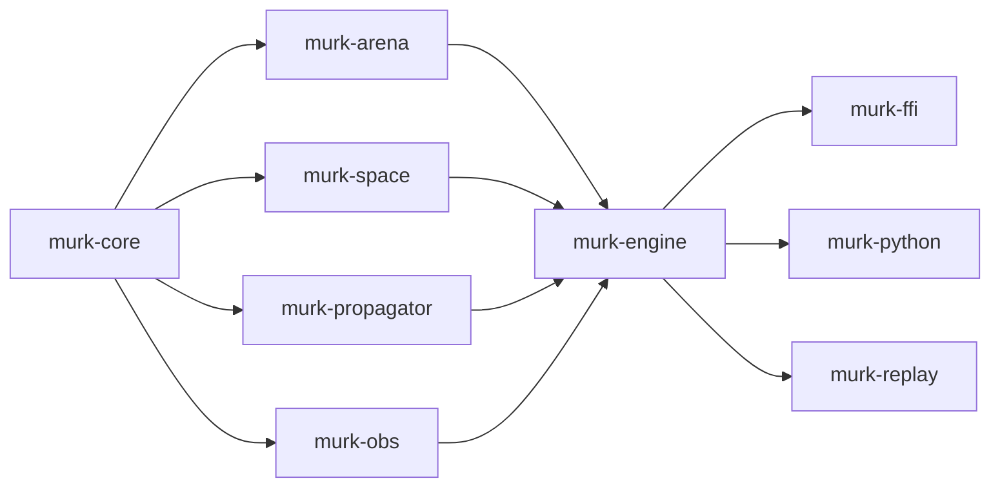

# Getting Started

## Prerequisites

**Rust** (for building from source or using the Rust API):
- Rust toolchain (stable, 1.87+): [rustup.rs](https://rustup.rs/)

**Python** (for the Gymnasium bindings):
- Python 3.12+
- numpy >= 1.24, gymnasium >= 0.29 (installed automatically)

## Installation

### From package registries

```bash
# Rust
cargo add murk

# Python
pip install murk
```

### From source

```bash
git clone https://github.com/tachyon-beep/murk.git
cd murk

# Rust: build and test
cargo build --workspace
cargo test --workspace

# Python: build native extension in development mode
cd crates/murk-python
pip install maturin
maturin develop --release
```

## Architecture overview



## First Rust simulation

Run the built-in quickstart example:

```bash
cargo run --example quickstart -p murk-engine
```

See [`crates/murk-engine/examples/quickstart.rs`](https://github.com/tachyon-beep/murk/blob/main/crates/murk-engine/examples/quickstart.rs)
for the full source. The essential pattern:

```rust,no_run
use murk_core::{
    BoundaryBehavior, FieldDef, FieldId, FieldMutability, FieldReader, FieldType,
};
use murk_engine::{BackoffConfig, LockstepWorld, WorldConfig};
use murk_space::{EdgeBehavior, Square4};

fn main() -> Result<(), Box<dyn std::error::Error>> {
    let space = Square4::new(8, 8, EdgeBehavior::Absorb)?;
    let fields = vec![FieldDef {
        name: "heat".into(),
        field_type: FieldType::Scalar,
        mutability: FieldMutability::PerTick,
        units: Some("kelvin".into()),
        bounds: None,
        boundary_behavior: BoundaryBehavior::Clamp,
    }];

    let config = WorldConfig {
        space: Box::new(space),
        fields,
        propagators: vec![], // add your propagators here
        dt: 0.1,
        seed: 42,
        ring_buffer_size: 8,
        max_ingress_queue: 1024,
        tick_rate_hz: None,
        backoff: BackoffConfig::default(),
    };

    let mut world = LockstepWorld::new(config)?;
    let result = world.step_sync(vec![])?;
    let heat = result.snapshot.read(FieldId(0)).unwrap();
    println!("mean heat: {:.4}", heat.iter().sum::<f32>() / heat.len() as f32);
    Ok(())
}
```

## First Python simulation

```python
import murk
from murk import Config, FieldMutability, EdgeBehavior, WriteMode, ObsEntry, RegionType

config = Config()
config.set_space_square4(16, 16, EdgeBehavior.Absorb)
config.add_field("heat", mutability=FieldMutability.PerTick)
# ... add propagators ...

env = murk.MurkEnv(config, obs_entries=[ObsEntry(0, region_type=RegionType.All)], n_actions=5)
obs, info = env.reset()

for _ in range(1000):
    action = policy(obs)
    obs, reward, terminated, truncated, info = env.step(action)
```

## Next steps

- [Concepts](concepts.md) — understand spaces, fields, propagators, commands,
  and observations
- [Examples](examples.md) — complete Python RL training examples
- [API Reference](https://tachyon-beep.github.io/murk/api/) — full rustdoc
